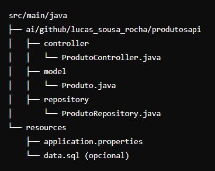
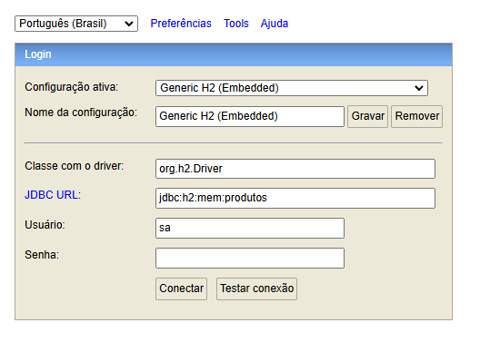

# Produtos API

Produtos API é uma aplicação desenvolvida em **Spring Boot (v3.4.0)** para gerenciar produtos, incluindo funcionalidades para cadastro, listagem, busca, edição e exclusão. O banco de dados utilizado é o **H2 Database**, um banco de dados leve e embutido.  

## 🛠️ Funcionalidades  

- **Cadastrar Produto**: Adiciona novos produtos ao banco de dados.  
- **Listar Produtos**: Exibe todos os produtos cadastrados.  
- **Buscar Produto por ID**: Retorna as informações de um produto específico com base no ID.  
- **Buscar Produto por Nome**: Pesquisa produtos utilizando um filtro pelo nome (usando SQL `LIKE`).  
- **Editar Produto**: Atualiza as informações de um produto existente.  
- **Excluir Produto**: Remove um produto do banco de dados com base no ID.  

## 🚀 Tecnologias Utilizadas  

- **Java 17**  
- **Spring Boot 3.4.0**  
- **H2 Database**  
- **Maven**  

## 📂 Estrutura do Projeto  




## 💾 Configuração do Banco de Dados  

A aplicação utiliza o **H2 Database**, configurado no modo console para facilitar o acesso.  

### Configuração Padrão (arquivo `application.properties`)  

```properties
spring.datasource.url=jdbc:h2:mem:produtosdb
spring.datasource.driverClassName=org.h2.Driver
spring.datasource.username=sa
spring.datasource.password=
spring.jpa.database-platform=org.hibernate.dialect.H2Dialect
spring.h2.console.enabled=true
spring.h2.console.path=/h2-console

Utilize as credenciais padrão:

JDBC URL: jdbc:h2:mem:produtosdb
Username: sa
Password: (deixe em branco)
```

## Acessando o Console H2
Após iniciar a aplicação, acesse o console H2 em:
http://localhost:8080/h2-console

Utilize as credenciais padrão:

JDBC URL: jdbc:h2:mem:produtosdb
Username: sa
Password: (deixe em branco)

Seu console H2 deve estar desse jeito para que possa usar corretamente



## 🛠️ Endpoints
1. Cadastrar Produto
POST /produtos/cadastro-produto

Body (JSON):

{
  "nome": "Produto Exemplo",
  "descricao": "Descrição do produto",
  "preco": 19.99
}

Resposta:

Produto cadastrado com sucesso! Produto Exemplo

2. Listar Todos os Produtos
GET /produtos/listar-produto

Resposta:
json
Copiar código
[
  {
    "id": "1",
    "nome": "Produto Exemplo",
    "descricao": "Descrição do produto",
    "preco": 19.99
  }
]

3. Buscar Produto por ID

GET /produtos/listar-porid/{id}

4. Buscar Produto por Nome

GET /produtos/listar-pornome/{nome}

5. Excluir Produto

DELETE /produtos/excluir-produto/{id}

6. Editar Produto

PUT /produtos/editar-produto/{id}

Body (JSON):
json
Copiar código
{
  "nome": "Produto Atualizado",
  "descricao": "Nova descrição",
  "preco": 29.99
}

## 🏃‍♂️ Como Executar
Clone este repositório:
bash
Copiar código
https://github.com/Lucas-Sousa-Rocha/produtosapi.git
Navegue até o diretório do projeto:
bash
Copiar código
cd produtos-api
Execute o projeto com Maven:
bash
Copiar código
mvn spring-boot:run
Acesse a aplicação em:
http://localhost:8080

## 📝 Licença
Este projeto está sob a licença MIT. Consulte o arquivo LICENSE para mais detalhes.

Agora você pode colar isso diretamente no seu repositório GitHub! 🚀
